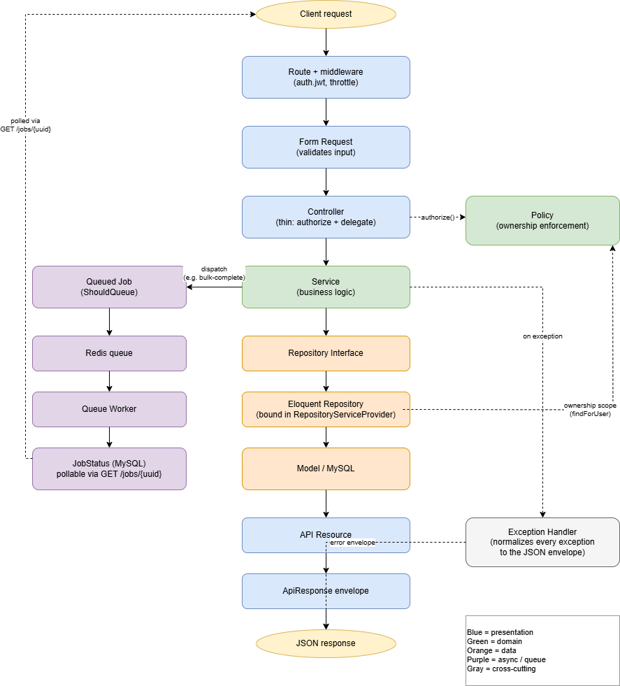

# Contributing

Conventions for this repository. Solo project, but the workflow is deliberate.

## Branching

`main` holds the initial Laravel 10 scaffold and receives one merge commit at
the end of the build. All work happens on short-lived branches off `develop`,
each mapped to a single issue.

```
main            scaffold ........................... final merge commit
                     \                                     /
develop               o--o--o--o--o--o--o--o--o--o--o--o--o
                       \  /   \  /      \  /
feature/*               ..     ..        ..
```

Feature branches are named `feat/<issue-number>-<slug>`, `ci/...`, `docs/...`
or `test/...` and are rebase-merged into `develop`, preserving each commit.

Squash merging is disabled at the repository level on purpose. Squashing the
final PR would collapse the entire history into a single commit on `main`.

## Commits

[Conventional Commits](https://www.conventionalcommits.org/): `feat`, `fix`,
`refactor`, `test`, `docs`, `chore`, `ci`. Scope is the area touched.

```
feat(todos): scope list query to the authenticated user

Closes #10
```

Each commit should leave the codebase working. Issue references go in the body,
not the subject line.

## Definition of done

An issue is done when all of the following hold:

- Feature and unit tests are written and passing
- `docker compose exec app vendor/bin/phpunit` is green
- `vendor/bin/pint --test` is clean
- No `Model::` calls exist outside `App\Repositories\Eloquent`
- Controllers depend only on services; services are the only layer touching repositories
- Services never read the request or build responses
- README updated if any setup step changed
- `docs/AI_USAGE.md` updated with any AI assistance used
- PR rebase-merged into `develop` with CI green

## Architecture rules




- Validation lives in Form Request classes, never in controllers or services
- Data access goes through a repository interface bound in `RepositoryServiceProvider`
- Repository methods take the authenticated user id and scope their queries, so
  ownership is enforced by construction rather than by a controller check
- Every response passes through `ApiResponse`, so the envelope has one owner
