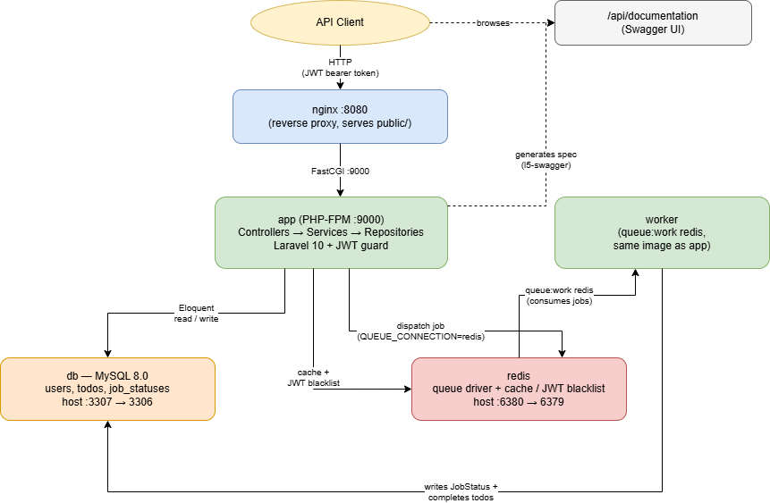

# User & Todo API

A dockerised RESTful API managing users and a per-user todo list. Layered Laravel 10 application (controllers to services to repositories) behind JWT authentication, with asynchronous work offloaded to Redis-backed queues.

## Architecture at a glance



Preliminary, high-level view of how the containers work together, client, nginx, the app
and worker (PHP-FPM), MySQL, and Redis as both queue driver and cache. See the
[Architecture](#architecture) section below for the request-handling detail.

## Requirements

- Docker Engine 24+ with Compose v2 (`docker compose`, not `docker-compose`)
- No local PHP, Composer or MySQL needed. Everything runs in containers.

Windows users: run from inside WSL2 with the project on the Linux filesystem
(`~/code/...`, not `/mnt/c/...`). Bind mounts across the Windows filesystem
boundary are slow enough to be noticeable on every request.

## Quick start

```bash
# 1. Configuration
cp .env.example .env

# 2. Build the images
docker compose build

# 3. Install dependencies
docker compose run --rm app composer install

# 4. Application key
docker compose run --rm app php artisan key:generate

# 5. JWT signing secret
docker compose run --rm app php artisan jwt:secret

# 6. Start the stack
docker compose up -d

# 7. Wait for db and redis to report healthy
docker compose ps

# 8. Schema and demo data
docker compose exec app php artisan migrate
docker compose exec app php artisan db:seed
```

Dependencies and the application key/JWT secret are generated with
`docker compose run --rm` before `docker compose up -d`. Compose reads
`env_file` into a container only when that container is created, so anything
written to `.env` after the app container is already running is invisible to
it until the container is recreated.

The API is then at **http://localhost:8080**.

Migrations are deliberately not run from the container entrypoint. Automatic
migration on boot races itself the moment the app runs more than one replica,
so it stays an explicit step here.

### Seeded accounts

| email | password | role |
|---|---|---|
| `alice@example.com` | `password` | user |
| `bob@example.com` | `password` | user |
| `admin@example.com` | `password` | admin |

Two regular users rather than one, so tenant isolation can be checked by hand:
log in as Alice, note a todo id, log in as Bob, request that id, receive a 404.
The admin account can call `GET /api/v1/users`; a normal user receives **403**.

## Services

| service | image | purpose | host port |
|---|---|---|---|
| `nginx` | `nginx:1.27-alpine` | serves `public/`, proxies PHP to `app:9000` | 8080 |
| `app` | built from `Dockerfile` (`dev` target) | PHP-FPM | — |
| `worker` | same image as `app` | `queue:work redis` | — |
| `db` | `mysql:8.0` | application and test schemas | 3307 |
| `redis` | `redis:7-alpine` | queue driver and cache store | 6380 |

Host ports for MySQL and Redis are shifted off their defaults so the stack does
not collide with anything already running locally. Change `FORWARD_DB_PORT` and
`FORWARD_REDIS_PORT` in `.env` if needed.

Redis is the queue driver, not only a cache. The `worker` service starts with
the stack and consumes jobs immediately, so no extra command is needed to see
asynchronous work processed.

## The queue worker

The worker runs automatically as its own service. To watch it:

```bash
docker compose logs -f worker
```

After `POST /api/v1/todos/bulk-complete`, the worker picks up `BulkCompleteTodosJob`
on the redis connection; follow the same logs (or poll `GET /api/v1/jobs/{uuid}`)
to see it move from `queued` to `completed` or `failed`.

To run one in the foreground instead, for example while debugging a job:

```bash
docker compose stop worker
docker compose exec app php artisan queue:work redis --verbose
```

Code changes are picked up on the worker's next job cycle only after a restart,
since queue workers boot the framework once:

```bash
docker compose restart worker
```

## Tests

```bash
docker compose exec app vendor/bin/phpunit
```

Tests run against a real MySQL schema (`user_todo_api_testing`), created by
`docker/mysql/init/01-create-test-db.sql` on first initialisation of the
database volume. No sqlite or in-memory shortcut, so behaviour under test
matches behaviour in the running stack, and running the suite never touches
seeded data in the application database.

Code style:

```bash
docker compose exec app vendor/bin/pint --test
```

## Common commands

```bash
docker compose exec app php artisan migrate:fresh --seed   # reset schema and data
docker compose exec app php artisan tinker
docker compose exec app bash                               # shell in the app container
docker compose exec db mysql -u utapi -psecret user_todo_api
docker compose logs -f app
docker compose down                                        # stop, keep data
docker compose down -v                                     # stop and destroy data
```

## Production image

The `Dockerfile` has two targets. Compose uses `dev`, which carries no
application code and expects the source to be bind-mounted, so edits are live.
The `production` target bakes in the source, installs without dev dependencies,
builds a class-map authoritative autoloader and disables opcache timestamp
validation:

```bash
docker build --target production -t user-todo-api:prod .
```

CI builds this target on every pull request, so the shipping image is never an
untested artifact.

GitHub Actions (`.github/workflows/ci.yml`) brings up the full compose stack, then runs `composer install`, `vendor/bin/pint --test` and `vendor/bin/phpunit` against it on every pull request to `main`/`develop` and every push to `develop`, and separately builds the `production` target above.

## Troubleshooting

**`docker compose up` fails complaining about `.env`**
Compose reads `.env` for both service configuration and variable interpolation.
Run `cp .env.example .env` first.

**Tests fail with `Unknown database 'user_todo_api_testing'`**
MySQL only runs the scripts in `docker-entrypoint-initdb.d` when the data volume
is first initialised. If the stack was started before that file existed:

```bash
docker compose down -v
docker compose up -d
```

**Permission errors writing to `storage/` or `bootstrap/cache/`**
The image remaps `www-data` to the UID and GID given as build arguments,
defaulting to 1000. If `id -u` reports something else, set `UID` and `GID` in
`.env` and rebuild with `docker compose build --no-cache app`.

**Port already in use**
Change `APP_PORT`, `FORWARD_DB_PORT` or `FORWARD_REDIS_PORT` in `.env` and run
`docker compose up -d` again.

**Jobs stay queued and never complete**
Check the worker is alive with `docker compose ps` and
`docker compose logs worker`. A worker that started before migrations ran will
have failed, and `restart: unless-stopped` should have recovered it.

**500 responses immediately after setup**
Usually a missing `APP_KEY` or `JWT_SECRET`. Re-run steps 4 and 5, then
recreate the containers so they pick up the new values:

```bash
docker compose up -d --force-recreate app worker
```

## Architecture

Controllers stay thin: Form Requests validate, Services hold business rules,
Repositories own persistence. See `CONTRIBUTING.md` for the layering rules.

Todos belonging to another user return **404**, not 403, a forbidden response
would confirm the record exists and allow id enumeration. Ownership is enforced
in the todo repository and again in `TodoPolicy`.

Roles are a string column (`user` / `admin`) with a `UserRole` enum — not
spatie/laravel-permission. Two fixed roles do not justify that package’s tables
and cache layer. `GET /api/v1/users` is admin-only via `UserPolicy::viewAny` and
is the API’s genuine **403** path for authenticated callers.

Public auth (`register` / `login`) is limited to **5 requests per minute** keyed
on email plus IP. Authenticated routes are limited to **60 requests per minute**
per user. Exceeding either returns the standard error envelope with a
`Retry-After` header.

There is no browser UI. HTTP entry points are the versioned JSON API under
`/api/v1` and OpenAPI at `/api/documentation`.

## API reference

Interactive OpenAPI documentation (Swagger UI) is at
**[/api/documentation](http://localhost:8080/api/documentation)**.

The committed spec lives in `storage/api-docs/api-docs.json` and can be
imported into Postman or Insomnia. Regenerate after annotation changes with:

```bash
docker compose exec -T -e HOME=/tmp app php artisan l5-swagger:generate
```

Locally, `L5_SWAGGER_GENERATE_ALWAYS=true` (see `.env.example`) regenerates on
each docs request. Production should generate once at deploy time instead.

## AI usage

Models, tools and prompts used during this build are listed in
[`docs/AI_USAGE.md`](docs/AI_USAGE.md).